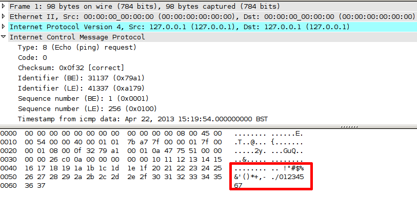
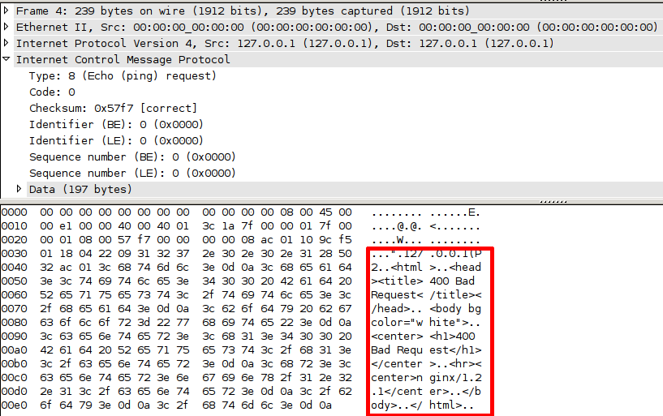

## Covert Communication Channels
Pete Maynard

## What is it?
> Any communication channel that can be exploited by a process to transfer information in a manner that violates the systems security policy.

## Which means..
Bypass restrictions of the firewall.

## How?
Disguise the data to bypass the firewall.

## Methods
- Bit manipulation
- Optional Fields

## Bit manipulation
- IP's ID Field
- TCP's ISN Field

## Optional Fields
- DNS RDATA field
- ICMP Payload

## ICMP Request Payload

## Covert ICMP Request Payload

## End
Thanks
